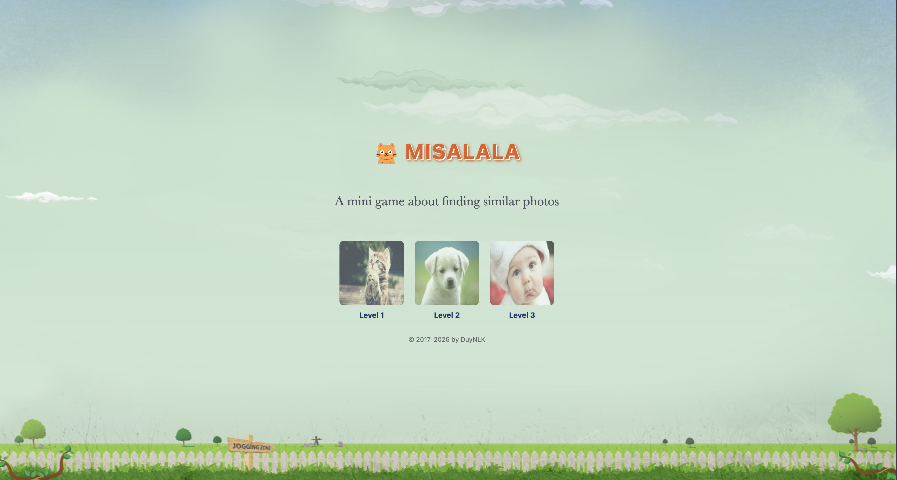

# MISALALA

A fun memory matching game where you find pairs of similar pictures using pure JavaScript.



## Description

MisaLala is a classic memory card game built with HTML, CSS, and JavaScript. Players flip cards to reveal images and match pairs. The game features multiple levels with increasing difficulty, score tracking, and a clean, responsive design. The codebase has been modernized using ES6+ JavaScript with a consolidated, modular structure.

## How to Play

1. Open `index.html` in your web browser.
2. Click on cards to flip them and reveal the images.
3. Find matching pairs by remembering the positions.
4. Complete all pairs in a level to advance.
5. Try to achieve the highest score possible!

## Features

- **Multiple Levels**: Start with Level 1 and progress through Level 2 and Level 3.
- **Score Tracking**: Your score is saved using localStorage.
- **Responsive Design**: Works on desktop and mobile devices.
- **Modern JavaScript**: Uses ES6+ features and modular code.

## Installation

1. Clone the repository:
   ```
   git clone https://github.com/duynlk/misalala.git
   ```
2. Navigate to the project directory:
   ```
   cd misalala
   ```
3. Open `index.html` in your preferred web browser.

No additional dependencies required!

## Technologies Used

- HTML5
- CSS3 (Flexbox/Grid)
- Pure JavaScript

## Project Structure

- `index.html`: Home page with level selection
- `game.html`: Dynamic game page for all levels (uses URL parameters like `?level=1`)
- `script/Game.js`: Consolidated game logic for all levels
- `style/`: CSS stylesheets
- `img/`: Game images

## Contributing

Feel free to fork the repository and submit pull requests. Suggestions for new features or improvements are welcome!

## License

This project is open source. See LICENSE for more details.
